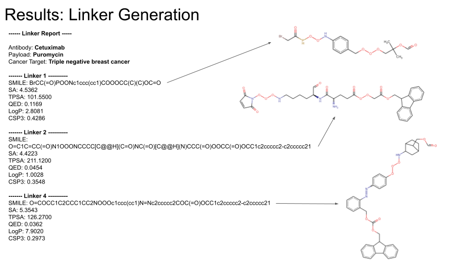

# Hello and welcome! 👨‍🔬🧬🧪

### My name is Alex Chase and I am a scientist with over 6 years of biotech experience. I am also a recent graduate of the Molecular Science and Software Engineering Master's program at UC Berkeley. My previous research centered around reagent development for a next-generation DNA sequencing platform. My current goal is to accelerate discoveries at the bench through rigorous computational science that leverages omics data. 

### My expertise lies in modeling and high-performance software, from simulating molecular dynamics to training ML models on complex genomic datasets. I am driven by research that bridges chemistry, biology and genomics to develop more personalized healthcare solutions and targeted therapies.

### [LinkedIn](https://www.linkedin.com/in/alex-chase/)

# Portfolio 🗃️🔬

## Generating novel ADC linkers via machine learning [ Repo -> [ADC-linker-generator](https://github.com/achase206/ADC-linker-generator) ]

Antibody drug conjugates are an important class of therapeutics which offer more targeted treatment for diseases like cancer compared to more traditional approaches. ADCs consist of three main components, the antibody which targets some surface protein, a drug payload to be delivered by the ADC and a linker molecule to connect the two. The objective for this project was to train a long-short term memory (LSTM) model via reinforcement learning to generate novel linker molecules optimized for specific antibody, payload and cancer indications. 

The image below shows an example of generated linker molecules. The user can specify which antibody, payload and cancer indication combination they would like the linker optimized around. These conditions are meant to affect the types of linkers generated. Their impact on the latent space during generation are discussed in the final report found in the repository.

## Parallelizing molecular dynamics [ Repo -> [parallel-md](https://github.com/achase206/parallel-md) ]

Molecular dynamics simulations are a classic application for parallel computing. Spatial decomposition is one such approach and is used extensively in popular libraries such as [LAMMPS](https://www.lammps.org/#gsc.tab=0). The objective of this project was to parallelize a starting code for a Lennard-Jones molecular dynamics simulation that was originally written to run in serial. A spatial decomposition approach was implemented using MPI where different ranks were assigned different regions in the simulation space. Additionally, a neighbor list approach was implemented to further optimize calculations within each spatial domain ([LAMMPS neighbor lists](https://docs.lammps.org/Developer_par_neigh.html)). 

The gif below shows how the simulation space is distributed across four ranks. A more in depth discussion can be found in the repository regarding scaling and benchmark results when running this code on an actual HPC cluster.

## GPU accelerated neural network from scratch [ Repo -> [CUDA-neural-net](https://github.com/achase206/CUDA-neural-net) ]

Neural networks fundamentally rely upon GPU acceleration to perform their computations. A starting code written in NumPy was provided as a base for this project. The objective was to port over this code which ran on a CPU to a code which primarily runs on a GPU. This was accomplished by writing custom CUDA kernels to perform the feed forward, back propagation and gradient update steps during training. CUDA kernels were managed via PyCUDA. Benchmarking was performed on an HPC cluster to generate roofline models and assess performance on different training tasks.

The model was trained to predict optimal molecular geometries for simple four-body systems. The plots below show the predicted A-B bond lengths and B-A-B bond angles for an AB3 ammonia molecule. The model shown below had a relatively deep but narrow architecture. Users can specify various architectures via custom json configuration files which allow for easy training and testing.

| Ammonia Stretch Prediction | Ammonia Bend Prediction |
| :---: | :---: |
|  |  |
| Deep Model Stretch [6, 128, 128, 128, 128, 64, 32, 1] | Deep Model Bend [6, 128, 128, 128, 128, 64, 32, 1] |

<!--
**achase206/achase206** is a ✨ _special_ ✨ repository because its `README.md` (this file) appears on your GitHub profile.

Here are some ideas to get you started:

- 🔭 I’m currently working on ...
- 🌱 I’m currently learning ...
- 👯 I’m looking to collaborate on ...
- 🤔 I’m looking for help with ...
- 💬 Ask me about ...
- 📫 How to reach me: ...
- 😄 Pronouns: ...
- ⚡ Fun fact: ...
-->
